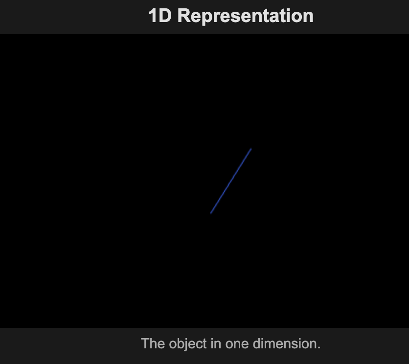
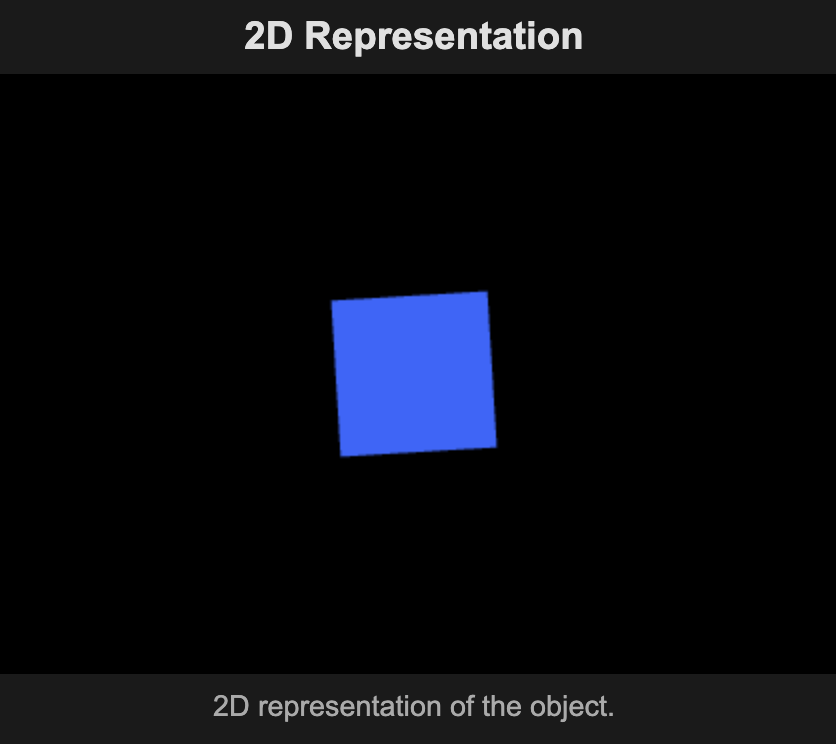
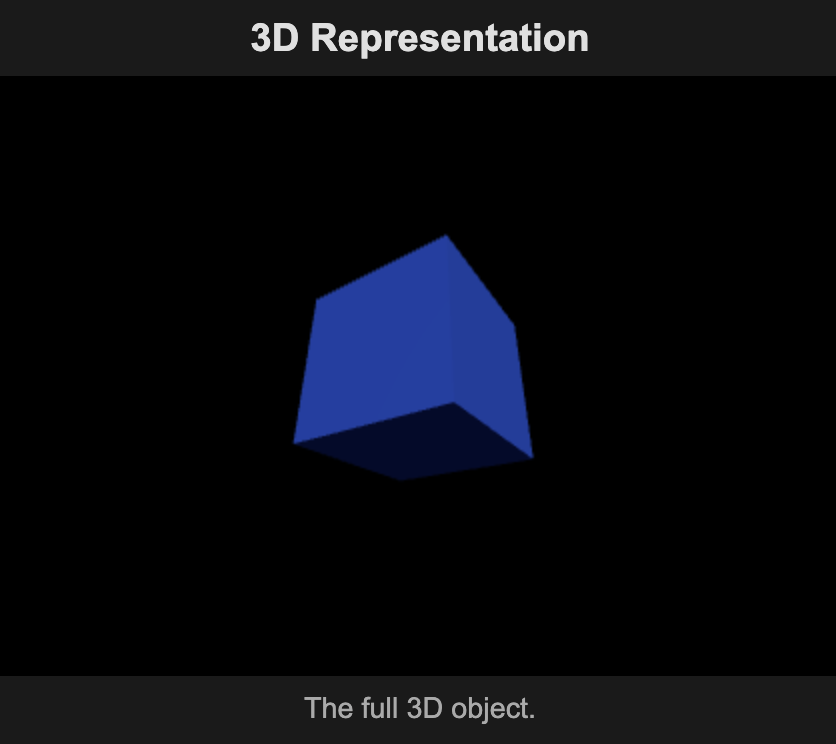
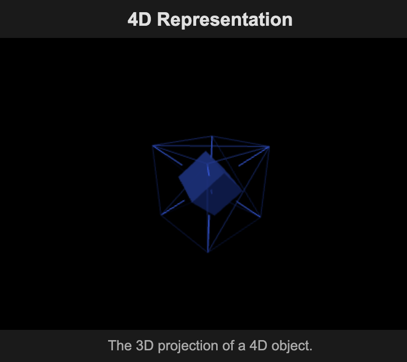

# Dimensional Objects Visualizer

A web application that generates high-quality, rotating graphics of geometric objects across different dimensions. This application allows users to visualize how objects like cubes, spheres, pyramids, and even human figures are represented across 1D, 2D, 3D, and 4D spaces.

## Features

- Visualize geometric objects across multiple dimensions:
  - 1D: Line representation
  - 2D: Shape representation (e.g., square for cube, circle for sphere)
  - 3D: Full 3D object
  - 4D: Projection of the 4D analogue (e.g., tesseract for cube)
  
- Currently supported objects:
  - Cube/Box (and its dimensional equivalents)
  - Sphere/Ball (and its dimensional equivalents)
  - Pyramid/Tetrahedron (and its dimensional equivalents)
  - Cylinder (and its dimensional equivalents)
  - Cone (and its dimensional equivalents)
  - Human figure (with anatomical detail across all dimensions)

## Dimensional Visualizations

### Cube Across Dimensions

Below are visualizations of how a cube appears in different dimensions:

#### 1D Cube (Line Segment)

In one dimension, a cube is represented as a line segment with length equal to the cube's side.

#### 2D Cube (Square)

In two dimensions, a cube becomes a square - a 2D face of the 3D cube.

#### 3D Cube

In three dimensions, we see the familiar cube with six square faces.

#### 4D Cube (Tesseract/Hypercube)

In four dimensions, a tesseract is typically visualized as a cube within a cube, with corresponding vertices connected.
  
- Interactive controls:
  - Dropdown selection for object types
  - Customizable object colors
  - Error feedback for unsupported object types
  
- Smooth rotation animations for all dimensional representations
- Detailed human figure representation with anatomical accuracy across all dimensions

## Setup and Running

### Prerequisites

- Modern web browser with WebGL support (Chrome, Firefox, Safari, Edge)
- Local web server for development (optional)

### Running the Application

1. Clone this repository:
   ```
   git clone https://github.com/samuelabdelsayed/dimensional-objects.git
   ```

2. Navigate to the project directory:
   ```
   cd dimensional-objects
   ```

3. Run the application:

   - Option 1: Using the included Node.js server:
     ```
     # Install Node.js if you don't have it already
     # Then run:
     node server.js
     
     # Then open http://localhost:3001/ in your browser
     ```
   
   - Option 2: Directly open the file in your browser:
     ```
     # Simply open the src/dimensions.html file in your web browser
     ```
   
   - Option 3: Using Python's built-in server:
     ```
     # Python 3
     python3 -m http.server
     
     # Then open http://localhost:8000/src/dimensions.html in your browser
     ```

## Visualization Examples

### Human Figure Across Dimensions

The human figure is represented with increasing complexity across dimensions:

- **1D**: A distinctive height pattern showing the human silhouette with anatomically accurate proportions. The varying heights create a recognizable human form profile when viewed as a one-dimensional line graph.

- **2D**: A detailed stick figure with anatomical proportions, articulated joints, facial features (eyes, mouth), and differentiated body parts. The 2D human includes properly proportioned limbs, a detailed head, and even finger representations.

- **3D**: A full 3D model with separate body parts using different materials for skin and clothing. Features include:
  - Detailed head with facial features, hair, and ears
  - Properly articulated limbs with joints at shoulders, elbows, hips, and knees
  - Differentiated materials for skin, clothing, and accessories
  - Anatomically correct proportions and posture

- **4D**: A hyperdimensional representation showing both the 3D human and its projection into the fourth dimension:
  - Inner 3D human representation with full anatomical detail
  - Outer 4D projection with tesseract-like boundary representing higher dimensional space
  - Dimensional connection lines showing the relationship between 3D and 4D space
  - Time slices representing movement through 4D space-time at different points
  - Temporal trails showing the path of the human figure through the fourth dimension

## Understanding Dimensional Transformations

### 1D Representation

In one dimension, all objects are represented as lines of varying lengths. The line's length corresponds to the "width" of the object in its original dimension:

- Cube → Line segment with length equal to the cube's side
- Sphere → Line segment with length equal to the sphere's diameter
- Pyramid → Line segment with length equal to the pyramid's base width

### 2D Representation

In two dimensions, objects are represented as flat shapes:

- Cube → Square (the face of a cube)
- Sphere → Circle (the equatorial cross-section of a sphere)
- Pyramid → Triangle (the face of a pyramid)

### 3D Representation

In three dimensions, we see the familiar full 3D objects:

- Cube → 3D cube with six square faces
- Sphere → 3D sphere
- Pyramid → 3D pyramid with a square base and triangular sides

### 4D Representation

For four dimensions, we visualize 3D projections of 4D objects:

- Cube → Tesseract (4D hypercube) represented as a cube within a cube with connecting edges
- Sphere → Hypersphere (4D) represented as nested spheres with circular cross-sections
- Pyramid → Hyperpyramid (4D) represented as nested pyramids with connecting edges

## Technical Implementation

The application uses Three.js for 3D rendering and WebGL for hardware acceleration. Each dimensional representation is rendered in its own canvas with appropriate camera and lighting setups.

For 4D objects, we use projections and special rendering techniques to create an impression of the fourth dimension:

- Tesseract: Represented as nested cubes with connecting edges between corresponding vertices
- Hypersphere: Represented as nested spheres with special circular cross-sections
- Hyperpyramid: Represented as nested pyramids with connecting edges

## Future Enhancements

- Add more geometric objects (cylinders, torus, etc.)
- Enable interactive manipulation of objects (manual rotation, scaling)
- Add more detailed explanations of dimensional mathematics
- Support for custom objects defined by mathematical formulas or mesh imports

## License

This project is licensed under the MIT License - see the LICENSE file for details.

## Author

Samuel Abdelsayed
